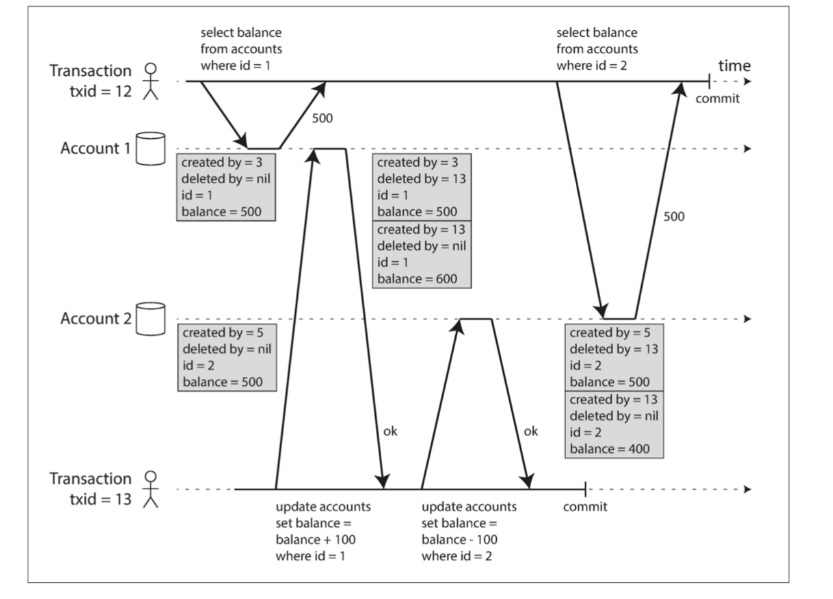

# ddia 第七章 事务

从概念上说，事务中所有的读写操作被视为单个操作执行。整个事务要么成功（`commit`），要么失败（中止`abort`或者回滚`rollback`）。

**如何正确使用事务？**需要明白事务可以提供的保障以及代价，理解实现事务中的微妙却重要的细节。

## ACID

事务提供的安全性保证，通常由`ACID`来描述：

- `A`：原子性，能够在错误时中止事务，丢弃该事务。系统只会处在操作之前或者操作之后的状态。*但是原子性的描述不是关于并发的*。
- `C`：一致性，对数据的一组特定陈述必须始终成立。例如，借贷相抵。某种意义上来说，*它是应用程序的属性*。因为它并不能真正避免用户脏数据的写入。
- `I`：隔离性，同时执行的事务是相互隔离的。真正意义上说，可序列化隔离可以真正实现事务之间的隔离，但是因为性能损失，通常采用*快照隔离*来实现（而在`Oracle`中被称为`可序列化隔离`）。
- `D`：持久性，一旦事务成功完成，即使硬件故障或者数据库崩溃，也不会丢失数据。完美的持久性并不存在——如果硬盘和备份同时销毁……

## 单对象和多对象操作

### 单对象写入

对于单个节点上的单个对象，存储引擎需要提供原子性和隔离性。原子性可以通过使用日志实现崩溃恢复，并且可以使用每个对象上的锁来实现隔离。

或者一些数据库提供复杂的原子操作，比如`CAS`（`compare-and-set`）。

### 多对象事务

多对象事务需要确定哪些读写操作属于同一个事务，关系型数据库中，通常基于客户端与服务器的TCP连接：在特定的连接上，`begin transaction`和`commit`之间的所有内容，被认为是同一事务。

虽然很多分布式数据存储已经放弃了多对象事务，但是多对象事务仍然是有必要的。

## 弱隔离级别

当几个事务同时运行时，有可能出现并发问题。数据库通过**事务隔离**来解决这个问题，可序列化的隔离等级意味着数据库保证事务一次一个的运行（即没有任何并发），但是会带来很大的性能损失。因此，系统通常使用较弱的隔离级别来防止一部分的并发问题，虽然它们也会导致一些微妙的错误。

对并发的种类和防止这些问题有深入的理解，可以让我们使用所掌握的工具构建可靠和正确的应用程序。

### 读已提交

读已提交(`Read Committed`)是最基本的事务隔离级别，是`Oracle 11g`，`PostgreSQL`等数据库的默认设置。可以保证没有*脏读*/*脏写*。

> 有些数据库支持更弱的隔离级别，读未提交(`Read Uncommitted`)，它只能防止脏写，不能防止脏读。

脏读：一个事务可以看到另外一个事务尚未提交的数据。

防止脏读可以避免一些问题：

- 用户读到部分数据的更新；
- 用户读到后面将会被回滚的数据。

脏写：一个事务会覆盖调另一个事务尚未提交的数据。

防止脏写也可以避免一些并发问题：

- 事务更新多个对象，每个事务都更新了一部分数据；

> 第二个事务读到数据的旧值，并且在第一个事务提交后（也对数据进行了修改）进行修改再提交，会导致第一个事务的**更新丢失**，但这不是脏写。

**如何实现读已提交？**

通常使用**行锁**来防止脏写：当事务想要修改特定对象，必须先获得该对象的锁。一次只有一个事务可以持有对象的锁，其他事务如要写入同一对象，必须等待前一个事务提交或者终止。这种锁定是读已提交模式（或者更强隔离级别）的数据库自动完成的。

而对于如何防止脏读，大部分数据库会记录数据旧值和当前持有锁写入的事务的新值，当事务正在进行时，读取该对象的其他事务都会拿到旧值，只有当新值提交后，才会切换到读取新值。

### 快照隔离和可重复读

读已提交可以解决脏读和脏写的问题，但是不能避免*不可重复读*的问题。

不可重复读：在第一次读取数据后，在另一个事务修改了该数据并且提交后，再次读取，从而读取到不一样的值。

> 与脏读不同的是，不可重复读读到的是已经提交的数据，而脏读是读到事务尚未提交的数据。

在这种情况下，数据虽然是正确的，但是有的时候也会带来问题：

1. 备份数据库时，如果包括了旧的部分和新的部分的数据，进行恢复时，不一致会变成永久的。
2. 对数据库进行扫描查询也是无意义的。

**解决不可重复读最常见的解决方案是快照隔离**。

快照隔离让事务*只能看到事务开始时*在数据库中提交的所有数据，每个事务只能看到特定时间点的旧数据。`PostgreSQL`、`InnoDB引擎的MySQL`、`Oracle`都支持。

**如何实现快照隔离？**

与读提交类似，快照隔离通常使用写锁防止脏写。但是读取不需要任何锁定，即读不阻塞写，写不阻塞读。

数据库保留一个对象的多个不同提交版本来防止脏读，也被成为`MVCC`（多版本并发控制）。

> 类似于读已提交时，只需要保留2个版本。支持快照隔离的数据库通常也使用`MVCC`来实现读已提交。

以`PG`为例：

1. 每个事务都会被赋予一个唯一的永远增长的事务ID(`txid`)。事务向数据库写入任何内容，数据都会被标上事务ID。
2. 表中每行都有`create_by`字段和`deleted_by`字段，分别包含插入该行和删除改行的事务ID。
3. `update`操作分解为`delete`和`insert`操作。

**如何应用？**

1. 读事务开始时，创建该对象的事务已经提交；
2. 对象未被标记删除，或者标记为删除，但是标记删除的事务在读事务开始时尚未提交。

满足以上两个条件，则可见一个对象。

1. 当事务12开始进行查询时，可以查询到由事务3创建的account1的值——500。
2. 事务13将事务3创建的account1的数据删除，并且新创建了一条account1值为600的数据。然后将事务5创建的account2的数据删除，新创建一条account2值为500的数据。
3. 事务12再次查询，即使事务13已经提交，但是晚于它开始的时间，所以不可见，仍然读取到的是事务3和事务5创建的旧值。

**索引如何实现快照隔离？**

可以简单地使用将索引指向对象的所有版本，根据查询来过滤掉不可见版本。而`CouchDB`等数据库采用仅追加/写时拷贝的方式，会创建一颗新的`B树`，但是这种方法需要负责压缩和垃圾收集的后台进程。

前面提到，在`Oracle`中，快照隔离被称为可序列化的，`PG`和`Mysql`称为可重复读。所以，不能仅仅根据名字来判断数据库所给予用户的保证是哪一程度的。

### 防止丢失更新

除了脏写，还有上面提到的丢失更新：前面的事务提交的数据，被后一事务提交的数据所覆盖，例如并发增加计数器。

**如何解决丢失更新？**

1. 原子写： 通常在读取对象时，获取排他锁来实现，以便更新完成之前没有其他事物可以读取它。关系型数据库通常支持类似于`set value=value+1`的操作。`Mongo`和`Redis`也提供了一些原子操作。虽然并不是所有的操作都可以用原子操作表达，但是可以使用原子操作的情况下，他们通常是最好的选择。
2. 显式锁定：例如显式使用`select... for update`将数据锁定，其他事务如果需要读取，则会强制等待。
3. 自动检测丢失更新：允许事务并行执行，当事务管理器检测到丢失更新，中止事务并强制重试。**`PostgreSQL`的可重复读，`Oracle`的可串行化都可以检测到自动丢失更新，但是`InnoDB的Mysql`并不会检测丢失更新**。丢失更新检测是自动发生的。
4. 比较并设置(`CAS`)：例如采用`update ... set a=1 where a=0`，如果内容不与旧内容匹配，则更新不起作用。但是如果`where`从旧快照读取，则仍然可能无法防止丢失更新。
5. 冲突解决和复制：在复制数据库中，多个节点上的数据可能被并发修改，因此基于锁或者`CAS`技术不适用。常见方法是允许并发写入多个冲突版本，并使用应用代码或者特殊数据结构在事实发生之后解决和合并。最后写入为准(`LWW`)容易丢失更新，但是是许多复制数据库中的默认值。

### 写入偏差和幻读

> 丢失更新是对于同一条数据的修改，而如果更改不同的数据，例如书中提到的医生休假，Alice和Bob都修改的自己的数据，即修改多个对象，则会带来写入偏差`write skew`。也可以说丢失更新是一种特别的写入偏差。

除了脏写和丢失更新，还可能在并发中出现*写偏差*。通常遵循下面的模式：

1. `select`查询符合条件的行，并检查是否符合要求
2. 按照1的查询结果，决定应用代码是否继续
3. 如果决定继续，则执行写入操作，提交事务。

例如医生休假，会议室预定，抢注用户名等场景，都遵循该模式。由于涉及到多个对象，但对象的原子操作不起作用，自动检测更新也不起作用。

**如何解决写偏差**？

数据库约束（例如唯一性，外键等）是可行的，或者使用触发器，物化视图。最后还可以采取可序列化的隔离级别。

如果实际情况中，查询不符合条件的行，但是其他事务增加了该行，改变了查询事务的结果，即出现了**幻读**，也会带来写偏差。但是，不存在的行没有对象进行加锁，在大多数情况下，可序列化级别是更可取的，物化冲突（人为引入锁）被视为最后的手段。

## 可序列化

可序列化（`Serializability`）隔离通常被认为是最强的隔离级别，可以防止所有的竞争条件。

**如何实现可序列化？**

主要有三种技术：

### 真的串行执行

完全不要并发，在单个线程上按顺序一次只执行一个事务。例如`Redis`。由于事务仍然以交互式的客户端/服务器风格执行，因此单线程串行事务处理系统不允许交互式的多语句事务。

### 两阶段锁定(`2PL`)

写入不仅会阻塞其他写入，也会阻塞读，读也会阻塞其他写入。主要是通过给对象天剑共享锁或者排他锁来实现的。

前面指出，解决幻读需要采用可序列化隔离级别。

谓词锁(`predicate lock`）锁不属于特定的对象，属于所有符合某些搜索条件的对象，当两阶段锁定包含谓词锁，数据库可以阻止所有形式的写入偏差从而实现串行化。

但是谓词锁性能不佳，因此大多数使用`2PL`的数据库实际上实现的是间隙锁(`next-key locking`)，通过使谓词匹配到更大的集合来简化谓词锁。例如将搜索条件的近似值附加到索引上，当事务想要写入某条数据，不得不更新索引的相同部分，会遇到锁从而进行等待。如果没有可以挂载间隙锁的索引，数据库就会退化到使用整个表上的共享锁。

### 序列化快照隔离

`2PL`性能不好，串行执行扩展性不好，可序列化快照隔离是一种新的（年轻的）算法。

与`2PL`不同，序列化快照隔离是乐观的并发控制技术。事务中所有的读取基于数据库的一致性快照，在此基础上，添加了算法来检测写入之间的序列化冲突，并确定要中止哪些事务。

**如何确定要中止哪些事务？**

需要判定快照的失效，考虑两种情况：

1. 读之前存在未提交的写入：当事务提交时，如果存在有被忽略的写入现在提交，事务必须中止。
2. 读之后发生写入：当事务提交时，它需要通知曾经读取了受它影响的其他事务（类似于间隙锁的思想）。

