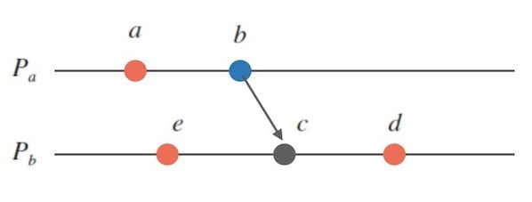

# ddia 第九章 一致性与共识

## 一致性保证

首先需要了解分布式系统能给用户带来的一致性的保证，才能决定哪一个适合自己的需求。

### 线性一致性

也被称为强一致性。基本想法很简单：**让系统看起来好像只有一个数据副本，而且所有操作都是原子性的**。它可以确保，一旦新的值被写入或者读取，所有后续的读都会看到写入的值，直到被再次覆盖（新鲜性保证）。

> 例如Alice和Bob因为读取到不同的从库，从而一个得到了比赛结束的比分，另一个还在比赛中的不同的结果。这种系统不是线性一致性的。

线性一致性在某些系统中是重要条件，比如：

- 锁定和领导选举：需要确保领导者只有一个，脑裂会带来严重的后果。
- 约束和唯一性保证：需要所有节点都同意一个最新的值，否则无法实现约束。
- 跨信道的时序依赖：比如异步进行处理时，可以认为不同的操作之间是跨信道的，如果它们是依赖于时序的，可能导致任务处理出现问题（例如文件存储和压缩任务属于两个不同的队列）。

那么，如何实现线性一致性？

> 最简单的答案是，只使用一个数据副本。但是它无法容错。

为了增加容错，增加了复制功能，包括单主复制、多主复制、无主复制，其中单主复制可能可以实现线性一致性，多主复制和无主复制（即使存在法定人数）也不是线性一致系统。

如果需要保证线性一致性，那么当副本掉线时不能处理请求，即副本服务不可用——不需要线性一致性的应用拥有更强的容错能力（`CAP`定理）。

虽然线性一致性是很有用的保证，但是真正应用的系统却很少。绝大部分的考量是出于性能，而非容错——`cpu`提供更快的速度，或者数据库提供更快的读写。

## 顺序保证

> 线性一致性的思想是看起来只有一个数据副本，并且每个操作都似乎是原子性生效的。意味着操作是以某种顺序执行的。

遵循因果顺序的系统，可以称作是**因果一致性**的。在某种情况下，因果顺序是很重要的：比如，用户应当先看到问题才看到答案。

> 快照隔离就提供了因果一致性。

线性一致性的系统都能正确保持因果一致性，并且在一致性模型中，因果一致性是可行性最强的一致性模型。在实现线性一致性代价比较高的情况下，可以考虑实现因果一致性。

那么如何确定因果顺序呢？

### 序列号顺序/时间戳

在单主复制中，主库可以为每个操作自增计数器，如果从库按照复制日志的顺序应用写操作，那么它始终是因果一致的。

在多主复制情况下，事情就没有这么简单了，这时可以采用兰伯特时间戳：假设事件`A`的计数器是$C_a$，事件`B`节点的计数器是$C_b$，如果`A`和`B`之间存在因果顺序，有$A<B$，那么$C_a < C_b$。它提供了一个**全序**：计数器值大者是更大的时间戳。但是因果顺序是**偏序**的：

例如虽然可以确定`b->c`，但是`a`和`e`，`b`和`e`的顺序是无法确定的。所以兰伯特时间戳给出的全序序列，在不相关的事件上，比较时间戳是无意义的。而**版本向量**是可以用来区分事件是否是并发的。

> 参照：[逻辑时钟 - 如何刻画分布式中的事件顺序](https://writings.sh/post/logical-clocks)

虽然兰伯特时间戳可以确定操作上的全序，但是需要在所有的操作都被收集之后才能确定。如果存在其他节点未知的操作，那么有可能这个操作最终会被插入到全序中的不同位置。所以还需要全序广播。

### 全序广播

全序广播通常描述为节点之间交换的协议，它需要保证没有消息丢失，并且每个节点接收到的消息顺序是一致的。`ZooKeeper`和`etcd`实现了全序广播(例如`ZooKeeper`中的`zxid`)：每个副本都按照相同的顺序处理写入，副本间将保持一致。如果后续的消息已经送达，节点不允许追溯地将先前的消息插入前面的位置。

全序广播等价于共识，但是是异步的，不能保证何时消息真正送达。因此与线性一致性还是有差距的。

## 分布式事务与共识

共识的目标在于“让几个节点达成一致”，在很多场景十分重要：比如在领导选举时，避免脑裂；有的节点执行事务失败而其他节点成功从而破坏事务的原子性（原子提交）。
