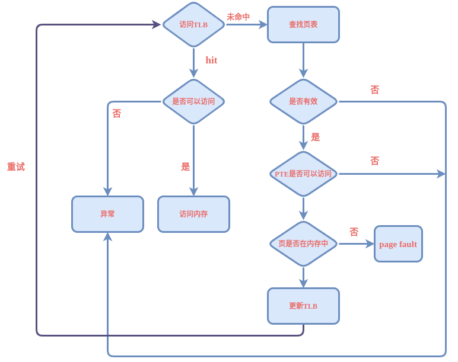

[TOC]

## Chapter 6

问题：
如何虚拟化`cpu`，让每个线程都觉得自己独立拥有cpu？
时分共享。每一个进程占用一定的cpu时间。

问题：
如何高效、可控地虚拟化cpu？
a. 如何执行受限制的操作（比如访问系统硬件资源）？引入了用户模式和内核模式。
b. 如何在进程执行后，操作系统重新获得cpu的控制权，以便进行进程之间的切换？
    i. 协作式，`OS`通过等待系统调用，或者非法操作发生，重新获得cpu控制权。
    ii. 非协作式，**时钟中断**。产生中断时，操作系统会重新获得cpu控制权。

> 操作系统获得控制权,如果决定进行上下文切换，需要为当前执行进程保存寄存器到内核栈，并且从内核栈为下一个需要执行的进程恢复寄存器。保证从陷阱返回时，是继续执行另一个进程。
## Chapter 7 
问题：
如何进行进程的调度？
1. 指标：
周转时间： T(周转时间) = T(完成时间) - T(到达时间)
响应时间： T（响应时间) = T(首次运行时间) - T(到达时间)
2. 方案
- a. 先进先出(`FIFO`),容易实现，但会产生护航效应(耗时较少的任务排在耗时较多的任务后)。
- b. 最短任务优先(`SJF`)，在某些情况下对周转时间友好(比如说任务同时到达)。
- c. 最短完成时间优先(`STCF`)，对`SJF`添加抢占，可以提升周转时间，但对响应时间不友好。
- d. 轮转(`RR`)，选择合适的时间片，切换不同的任务执行，对响应时间友好。但是对周转时间不友好。
> 总结：在短时间内，每个任务都能均匀得到响应，这种公平的策略，周转时间表现不佳。
- e. 结合`I/O`,当执行`I/O`操作时，进行其他CPU密集型任务。

作业：
- 1. FIFO：响应时间：（0+200+400）/3 = 200 周转时间：（200+400+600）/3 = 400

SJF: 响应时间： （0+200+400）/3 = 200 周转时间： （200+400+600）/3 = 400

- 2.FIFO: 响应时间：(0+100+300)/3 = 133.33 周转时间: (100+300+600)/3 = 333.33

SJF: 响应时间： （0+100+300）/3 = 133.33 周转时间： （100+300+600）/3 = 333.33

- 3. RR: 响应时间：（0+1+2）/3 = 1 周转时间: (598+599+600)/3 = 599
- 4. 任务长度短，先到的任务，SJF与FIFO周转时间一样。
- 5. 所有任务的工作长度小于等于时间片长度，SJF与RR响应时间相同。
- 6. 工作长度增加，SJF的响应时间会增加。
- 7. 时间片长度增加，RR响应时间会增加，增加到大于工作长度，转变成SJF。
```
假设第i个任务工作长度为li，时间片长度为m，响应时间r：
当`m<li`(任意i): r = m;
当最坏情况时，`m>li`(任意i)：
r = (0 + l1 + l1 + l2 + l1 + l2 + l3 + ... + l1 + l2 + ... + ln-1)/n = ((n-1)l1 + (n-2)l2 + ... + ln-1) / n = sum((n-i)*li)/n，其中i从1到n-1。
```
## Chapter 8
问题：
`SJF`和`STCF`都依赖于任务的长度，如何在不知道任务长度的情况下（通常情况下），进行调度？

方案：多级反馈队列，`MLFQ`。存在许多独立队列，每个队列有不同优先级。任何时刻，一个工作只能存在于一个队列中。`MLFQ`总是执行较高优先级的工作。每一个队列中采用轮转进行调度。

基本法则：
- A优先级>B优先级，运行A （执行高优先级队列）；
- A优先级=B优先级，轮转 （同一队列，轮转调度）；
- 任务首次到达，总是在高优先级队列 （缩短响应时间）；
- 任务用完时间片，降低优先级到下一队列 （防止其他任务饿死，防止用户不停让出cpu，被认为是交互性，一直停留在最高级队列）
- 周期性提升所有任务优先级到最高 （防止饿死，防止任务从cpu密集转换成交互型，调度系统仍然按照cpu密集型处理，将其放置在最低优先级队列）

除此之外，每一层队列通常设置不同长度的时间片，优先级低的队列（通常防止cpu密集型任务）时间片越长。

## Chapter 9
问题：
和关注响应时间与周转时间不同，如果关注cpu使用率，如何按比例分配cpu，保证每个任务都能获得一定比例的cpu时间？

方案：
- 彩票调度： 随着工作时间变长（时间片变短），可以降低平均不公平度（完成的时间之比）；
- 步长调度： 可以保证每个调度周期（不同任务的步长值相等）后，概率完全与票数比例一致。

彩票调度可以通过随机值做到按比例分配，步长调度可以获得确定的需要的比例。但是没有办法确切地知道票数(计算步长)，也不太容易考虑I/O的影响。所以在虚拟环境中，具有更好的应用。

## Chapter 10
问题：
在多cpu上应该如何调度？

存在的问题：
- 多cpu上会出现缓存一致性问题：在基于总线的系统中，可以采取总线窥探的方式，本地缓存监听总线，发现数据更新，则本地缓存更新为新值。这是由硬件层面进行保证的。
- 跨cpu的同步问题：跨cpu访问或者写入共享数据时，需要使用互斥原语（比如锁），才能保证操作的正确性。
- 缓存亲和度：不同的进程在切换cpu上运行时，因为数据在缓存中不存在，需要重新加载而很慢。

解决方式：
- 单队列多处理器调度（`SQMS`）：实现简单，在多cpu情况下需要加锁（扩展性不好），也没有考虑缓存亲和度。
- 多队列多处理器调度（`MQMS`）: 每个cpu一个队列，避免加锁，所有任务保持在固定的cpu上，缓存亲和度得到保证。但会导致负载不均衡，可以采用任务迁移的方式解决，但何时迁移是一个需要考量的问题。

总结：构建通用的调度程序很难。

## Chapter 13
问题：
如何在单一的物理内存上为多个运行的进程构建私有的很大的地址空间的抽象(让每一个进程都认为自己拥有整个内存)？

虚拟化内存需要保证：
- 透明： 程序不应该感知内存被虚拟化的事实；
- 效率： 高效，时间上（不会使得程序变慢）和空间上（不需要太多额外内存来支持）；
- 保护： 进程之间内存应当是隔离的，避免相互影响

通过代码打印出来的内存地址，都是虚拟地址。只有操作系统才知道真正的物理地址 。

## Chapter 14
C语言中通常采用`malloc`和`free`来分配和释放堆空间。栈内存由编译器隐式管理。

`malloc`分配的资源在堆上，调用`brk`的系统调用，改变堆的分断地址，减小堆的大小（堆是自顶往下增长的）；`free`相反，采用`sbrk`。

## Chapter 15
问题：
如何实现高效的内存虚拟化（OS尽量让程序自己运行）？如何提供应用程序的灵活性（程序可以以任何方式访问自己的地址空间）？如何保持控制应用程序可访问的内存位置(内存受限)？

1. 采用**基于硬件**的地址转换，通过硬件将指令中的虚拟地址转换为实际存储在内存中的物理地址，可以提高效率。

2. 每个cpu需要一对硬件寄存器：基址(`base`)寄存器和界限（`bound`）寄存器。编写程序时，代码（程序员）假设地址空间从0开始。但是执行时，操作系统会决定在物理内存中的实际地址，并且记录在基址寄存器中。

3. 所有的地址转换遵循： `实际地址 = 虚拟地址 + 基址地址`的方式计算。这种方式，也被成为动态重定位。

4. 界限寄存器的作用是防止计算出的实际地址超出所分配的地址，保证所有地址都在进程地址的界限之中。

5. 负责计算实际地址的硬件称为`MMU`。
6. 进行上下文切换时，比如从进程A切换至进程B，会将当前cpu中存储的进程A的基址寄存器的值和界限寄存器的值保存在进程中，比如`PCB`中。然后再将B的`PCB`中的基址寄存器和界限寄存器的值读入。
7. 当新进程建立时，从空闲列表中为新地址空间寻找位置。

## Chapter 16
问题：
将进程地址空间完整加载到内存中，栈和堆之间的空闲无法得到充分利用，造成浪费。如何支持大地址空间，同时减少内存空间的浪费？

采用分段的方式。在`MMU`给每个段增加一对基址和界限寄存器（段寄存器）。即，代码，栈和堆。这样，可以将每个段独立地放入物理内存。

如何在地址转换的时候知道段内偏移量和所在哪个段？
- 显示方式：用虚拟地址前两位区分段，后面的位数代表段内偏移量。
- 隐式方式：通过地址的来源来区分段。
> 段寄存器还可以保存内存增长方向，用以支持栈反向增长。

如何支持内存之间的共享？比如代码共享？
- 在段寄存器中增加保护位，标识是否能够读写该段。

每个进程有自己独立的虚拟地址空间，在切换进程时，需要保存当前进程段寄存器内容，恢复即将运行的进程段寄存器内容。

随着进程的不断创建，物理内存中会存在许多空闲的小块，很难分配给新的大段或者扩大已有的段(外部碎片)。如何解决？
- 重新安排原有段，整理，复制。
- 空闲列表管理，匹配到最合适的内存块用于分配。但无法消除碎片。

## Chapter 17
问题：
如何有效的管理空闲空间？性能最高？产生的碎片少？

基本策略：
- 最优匹配：性能代价较高
- 最差匹配：性能代价高，也会导致过量的碎片
- 首次匹配
- 下次匹配

除此之外，还有其他的方式可以考虑：
- 分离空闲列表：将某个程序经常申请使用的固定大小的内存空间采用独立列表进行管理，其他大小的请求由通用内存分配。因此特定大小的内存分配和释放都很快。
- 伙伴系统：每次只允许分配内存为2的整数次幂，虽然会有碎片，但是合并起来效率很高。

`tips`： 作业中需要注意的，每一块上头都有4个字节，所以如果Alloc（5），实际上需要分配9个字节的内存，加上对齐，总共需要12字节，但是返回的指针并不是从这个头的地址开始的。以此类推。

## Chapter 18
分段是将内存分配成为不同长度的分片，会导致碎片化，随着时间推移，分配内存会比较困难。

问题：
将内存分配为相同长度的分片（分页），如何使用这种技术实现虚拟内存？

分页的优点：不需要考虑进程如何使用内存（堆和栈的增长方向）；空闲空间管理方便。

通常，每个进程都有一份页表。页表保存进程中虚拟页与实际物理内存页的映射关系，即：
```
VP0 -> PF3
VP1 -> PF7
...
```
为了根据虚拟地址获得实际地址，需要对虚拟地址进行转换。虚拟地址的结构可以表示如下：
```
虚拟页号（VPN） + 页内偏移量（offset）
```
例如，进程是64字节（2^6）,那么虚拟地址最少需要6位表示。假设页大小为16字节（2^4），那么页内偏移需要低4位，高2位可以用于表示VPN。更具体的例子：假设虚拟地址是21（`010101`），那么VPN是`01`，页内偏移量`0101`。根据页表`VP1 -> PF7`，再加上页内偏移，则实际的物理地址是（物理页表号+页内偏移量）`01110101`。

页表的每个条目`PTE`的结果可以表示如下：
```
PFN（物理内存页号） + 各种标志位
```

目前来说，分页存在的问题：

1. 页表可以非常大，例如32位系统，页大小为4K（2^12），那么VPN就会有20位，意味着会有2^20个地址转换，如果每一个转换条目需要4个字节，那么会需要2^22大小，也就是4MB的内存。而这仅仅是一个进程所需要的页表大小。
2. 分页可以非常慢。读取数据时，首先需要去页表中获取PTE（分段时只需要根据基址加上偏移量就可以获得实际物理地址），再进行转换，接着去物理内存中读取数据。通常页表是存在于物理内存中，所以需要额外的一次内存读取（表现在代码中，有两次`AccessMemory`）。

## Chapter 19
问题：
如何加速地址转换？尽量避免分页中带来的那一次额外内存访问？

方案：来自于硬件的帮助。硬件增加一个`TLB`（地址转换缓存），每次内存访问，硬件首先检查TLB，看看是否存在期望的映射。如果有（命中），就可以不通过访问页表进行转换。如果未命中，则硬件需要访问页表获得转换映射，并且利用映射更新TLB。

TLB在处理器核心附近，访问速度很快。如果未命中，则还是需要访问页表，新的问题随之产生：如何尽可能避免TLB未命中？如果未命中，应该由谁去处理？
1. TLB很适合于具有时间局部性（例如循环变量）和空间局部性（例如数组）的程序。页的大小变大，也可以降低未命中，通常页大小被设置为4KB。
2. 有两种方案，可以由硬件全权处理，现代的体系结构使用软件进行处理（陷阱处理程序）。

一条TLB项的内容大概可以描述如下：
```
VPN | PFN | 其他位
```
上下文切换时，TLB内容的处理可以有几种解决方案：
1. 清空上一个进程的TLB内容，即将有效位置为0;在频繁切换上下文的时候，开销会很高。
2. 在TLB中增加地址空间符（ASID），描述每一项TLB是属于哪一个进程的。

TLB中的替换也需要考虑，类似于常用的缓存中的替换策略，比如最少使用（`LRU`），随机策略等。

## Chapter 20
问题：Chapter19旨在解决分页带来的慢的问题，而页表比较大的问题应该如何解决？

方案：
1. 更大的页。
> 32位地址空间，假设采用4KB的页，有12位的偏移量，20位的VPN。如果一个条目是4字节，那么页表将会是4×2^20=4MB的大小。如果将页增加为16KB，那么有14位的偏移量，VPN缩短到18位，每个页表大小也缩短为4×2^18=1MB的大小。页表缩小了1/4。

但是更大的页会带来每个页内部空间的浪费（内部碎片问题），应用程序只使用大页中的一小部分。

2. 分页和分段混合。不为进程的整个地址空间提供单个页表，而是为每个逻辑分段提供一个。段寄存器中存储的是该段的最大有效页值，段之间未分配的页无需占用页表中的空间。

但是如果内存比较稀疏，仍然可能带来页表的浪费。分段也会导致外部碎片再次出现，因为现在的页表不再是页面大小的倍数，而是PTE的倍数（例如，如果栈段只使用了0,1,2页，那么页表中只需要存储VP0->PF0,VP1->PF1,VP2->PF2，而堆段使用了5页，6页，那么页表会接下来存储VP5->PF5,VP6->PF6...）。

3. 多级页表。一直以来讨论的是以数组作为结构的页表（线性页表），多级页表采用树型结构。页目录中存放下一级页表的位置，页表之中也可以继续存储下一级页表的位置，以此类推。多级页表的关键在于：每一个部分都放入一页。
> 注：PTBR：页表基寄存器，用来获取PTEaddr（PTEaddr = PTBR + （VPN × sizeof（PTE））。PDBR：页目录基寄存器。

但是多级页表需要更多次对内存的查找，对硬件和操作系统的复杂程度要求更高。

4. 反向页表。与每一个进程一个页表不同，整个系统中只有一个页表，每一项代表系统中的每一页，记录当前被哪个进程使用，被哪个虚拟页映射。

5. 页表交换到磁盘。

`tips`：
1. 第一题，只需要一个寄存器`PDBR`，看伪码可以得出。只需要一个页目录基址寄存器即可。
2. 第二题，以`python paging-multilevel-translate.py -s 1 -c`为例，分析第一个例子：
```
Virtual Address 6c74: Translates To What Physical Address (And Fetches what Value)? Or Fault?
```
`6c74`展开：0（110 1100 0111 0100），因为虚拟地址空间是32KB=2^15，页大小是32字节=2^5，所以有5个offset，剩余10个VPN位，要将所有页表部分放置于一页，所以将VPN进行拆分，前10位中的高5位作为页目录索引，低5位作为页表索引。所以虚拟地址结构如下：
```
11011 00011 10100
```
页目录索引的值为`11011`= 27，题目给出第17页是页目录的地址，找到page17的第27个位置（从0开始）的值：
```
page  17:daf7f2a896c59d94c8b97fc498e57f7fd3a1828fa6fbbff07f84d2|a0|8880c992

```
值为`0xa0`，这是`PDE`的值，展开： 10100000。根据题目知道，最高位代表是否可用，因此`a0`是`valid`，剩下7位代表页表的地址，即100000 = 32；

页表索引的值为`00011`，即到page32找到第3个值：
```
page  32:7f7f7f|e1|7f7f7f7f7f7f7f7f7f7f7f7f7f7f7f7f7f7f7f7f7f7f7f7fdb7f7f7f

```
得出PTE的值为0xe1，同样的高位为1，`valid`，剩余7位，`1100001`= 0x61 = 97；
最终去第97页寻找offset为`10100`（20）的值：
```
page  97:0f0d14180200190d17000d16071d1b0000101d0b|06|0d00060d0f0707060e0800
```
得出值为06。物理地址等于最终的`1100001` + `10100` = `1100 0011 0100` = 0xc34。
即：
```
Virtual Address 6c74:
  --> pde index:0x1b [decimal 27] pde contents:0xa0 (valid 1, pfn 0x20 [decimal 32])
    --> pte index:0x3 [decimal 3] pte contents:0xe1 (valid 1, pfn 0x61 [decimal 97])
      --> Translates to Physical Address 0xc34 --> Value: 06
```

## Chapter 21
问题：如果物理内存有限，进程的地址空间无法放入，应该如何处理？

方案：在硬盘（通常很大，但是很慢）上开辟一部分空间当做交换空间，用于物理内存页的移入和移出。
1. 如何确定页在硬盘还是在物理内存中？
> 在PTE中，使用存在位（`present`）标识当前页是否存在于物理内存中。如果访问不在物理内存中的页，会触发页错误（`page fault`）。
2. 当触发了页错误后，如何去指定的硬盘地址中找到该页并放入内存中？
> 可以利用PTE中存储PFN的位来存储硬盘地址。总之，当出现页错误，操作系统会在PTE中查找地址，将请求发送到硬盘，读取到内存中。

当完成了页换入后，操作系统会更新页表，将此页的PTE的存在未以及PFN字段进行更改。并且在下一次重试后，更新到TLB。

3. 如果物理内存满了应当如何处理？
> 利用页交换策略将物理内存中的一些页交换出去。

所以现在访问内存的流程变得更加复杂了。
  

4. 何时真正进行交换呢？

> 为了保证有少量的空闲内存，大多数操作系统会设置高水位`HW`和低水位`LW`，当后台运行的交换守护进程（或者，页守护进程）检测到少于`LW`个页可用时，会将内存页交换出去，直到存在`HW`个页可用。
>
> 因此，在发现页错误后，首先会检查是否存在空闲页。如果不存在空闲页，则等待后台线程释放内存，当释放到一定数目的页时，则可以把需要的页交换进内存。

## Chapter 22

问题： 如何决定从物理内存中换出哪一页？

优化的目标是尽可能的让未命中次数减少，命中次数增加。

经典替换策略：

- 最优替换（`OPT`）：难以实现，但是可以用作衡量其他策略的基准。
- 先进先出（`FIFO`）
- 随机（`RANDOM`）
- 最少最近使用（`LRU`）：利用了历史信息，结合局部性原则，有一定提升。

但是相比之下，`LRU`需要对每一次访问内存都进行变更（比如更新访问时间），调整页的顺序，代价十分高昂。因此，大多数系统采用：

- 近似`LRU`：通过在PTE中增加使用位（参见18章），并且利用时钟算法周期性的清除使用位——比如这种方案，如果使用位为0，则替换出去；为1则置为0，并且寻找下一页。

  > 除此之外，还可以增加脏位。倾向于将未被修改的脏页替换出去。

写入策略：除了替换策略，操作系统也需要考虑到何时将内存写入到磁盘。比如可以单个写入，或者进行收集后，聚集写入或者分组写入。

当操作系统频繁换页时（抖动），可以采用准入控制，减少进程；或者像当代的一些操作系统，执行更严格的方法，将进程直接杀死。

## Chapter 23

空指针的实际作用是生成一个虚拟地址0，因此硬件在TLB中查找VPN为0的项，会遇到未命中。查询也变，发现该PTE被标记无效，从而将控制权交还给操作系统。

`copy-on-write`(`COW`，写时复制)：如果操作系统需要将一个页面从一个地址空间复制到另一个地址空间，不需要实际复制。只需要将页面标记为只读，如果进程之间都是读该页面，则相安无事。如果有进程尝试写入页面，会陷入操作系统。操作系统会为该进程分配一个新页并填充数据，再将新页地址映射（例如，不改变基址寄存器和界限寄存器），相当于有了一个全新的副本。即，只有当需要写的时候，才会真正开始复制。例如`fork`和`exec`，如果子进程不对内存空间进行写入，父进程的数据并不会复制给子进程，加速了子进程的创建速度。

